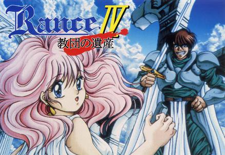

大家好，这里是卡拉保护协会带来的兰斯4中文版，这也是我们协会的处女作。

兰斯4原是A社在1993年发行的PC-98平台上的回合制RPG游戏，后经A社移植至Win95平台，现已免费发布。在兰斯3/03中，兰斯因为在恶魔回廊踩了光之神（踏板）惹怒了神明，在与魔王姬尔的战斗中胜利的同时，兰斯和希露被愤怒的光之神传送到了斗神都市，就这样，二人踏上了探寻斗神都市的旅程，这就是4的故事开端。

不少哈尼们可能经常会被安利兰斯时听到“看一下剧情贴就好了啦”这样的说法，但对于一个无论是侧重剧情还是注重玩法的玩家，兰斯4都是非常值得体验的。4跟后续特别是9、10的人物、剧情和伏笔关联也很多，而且这可是当年原画超过５０００张的大作！总之，4的汉化有了！不多多体验下那个绿衣服男人的传奇就可惜了！

需要下虚拟机或者模拟器玩吗？不需要！汉化版采用的是全新的优化版引擎，适用于Win7、Win10，32位和64位系统均可运行。不过如果你是WinXP的话，抱歉，目前暂不支持。在脚本上相对日文版也处理了很多BUG（帮日文版擦了很多屁股），总之，开始玩就是了。

【Ｑ＆Ａ】

Ｑ：为什么不是补丁式发布？

Ａ：兰斯4本体符合AliceSoft的免费分发声明。但是请勿录播直播哦，这也是A社声明的一部分和我们的要求。根据声明，盈利性分发包括销售、付费网站的分发也是不允许的，所以玩家如果发现贩售行为请对卖家投诉差评。

Ｑ：本游戏是按照日文还是英文翻译的？

Ａ：文本是全部按照日文进行初翻和校对的，忠实于原意。不过因为［郁金香女神玛利亚］英翻组在很多细节方面也很注重，所以也进行了适当参考以校正文本。

Ｑ：游玩要注意什么？

Ａ：目前还不支持文本回溯，所以谨慎使用右键快进，以免错过重要剧情！

Ｑ：本作有较多较严重的虐心情节／雷吗？

Ａ：没有。我觉得对于兰斯系列的玩家来说，本作算是比较“纯爱”的，按顺序玩4的话问题不大。

【攻略要点】

存档读档请呼叫系统神。详细攻略可以参考雯晟俊杰的专栏。

【Staff】

组长：喻园咖吧

初翻：落羽碎風、喻园咖吧、光与影的狂舞

校对：Urbino、LibCommander

润色：会骑可乐猪、LibCommander

程序：喻园咖吧

测试：雯晟俊杰

修图：夜溟泠雪、萤火蟲

特别感谢：kichikuou、RottenBlock、隐性恶疾

＊＊＊＊＊＊＊＊汉化感想＊＊＊＊＊＊＊＊

喻园咖吧（组长＆初翻＆程序＆...）：

Gal圈混迹多年的我被安利了兰斯，就一发不可收拾地打完了全系列，最终萌生了让那个男人的传说更完美的想法。

当组长很锻炼人，特别是各环节组织参与。有时一些BUG一查是原版就有的BUG，也得去改，最后项目管理的提交就有四百次……经验和人手都不足，但是出于热爱经常肝到半夜。其他的也在做了！也希望有更多大手子能加入我们的说！

落羽碎風（初翻＆测试）：

萌新探头——

真·日语渣还是第一次做初翻，感谢喻大带我进汉化坑并教会我不少东西。

各种问题给喻大一帮大佬添麻烦了，不过好歹在最后搞定了文本，果然只要有爱爆肝什么的完全不是问题啊...

嗯，不说了继续埋头爆肝，同时减少错误少给大佬们添麻烦吧。

光与影的狂舞（初翻）：

我在当时玩兰斯系列的时候就因为兰斯4比较古老的画风和古老的操作ui被劝退了，最后是看贴吧的剧情贴结束的r4。

作为一个强迫症患者，我个人还是喜欢游戏要从头开始玩，因此当时没玩4、4.1、4.2对我来说也是非常遗憾的一件事。

我个人觉得，如果可以在现在游玩的游戏中看见前作里面的角色出场，真的是一件非常让我感动的一件事，看见他们的成熟很让人开心。

所以，希望大家可以好好玩玩看这个游戏，不要像我之前一样浅尝辄止，希望各位新老哈尼能够好好享受这款游戏，啪叽啪叽。

Urbino（校对）：

兰斯系列是我很喜欢的作品，很幸运能参加兰四的汉化！这是我第一次汉化游戏，感觉和之前汉化漫画啥的完全不一样。因为这一次汉化的是比较有年代的作品所以汉化的时候经常边查边翻，姑且算是学到了一些东西，但总是有词不达意的感觉，果然是因为文学素养不够，今后会更加努力！

LibCommander（校对＆润色）：

身为一个玩过了全系列，唯独缺了个4没有玩的人，非常感谢灯酱（组长）组织并完成了R4的汉化，尤其是灯酱还解决了古老R4程序上的许多问题，并对程序本身作出了许多的优化，改善了许多游戏上的体验。毕竟我之所以没玩4，很大程度上就是官网公开的版本运行上出现了许多问题，把我给卡住了。而现在，灯酱把这些基本都解决了，灯酱牛逼！让人想玩！基于现在a社的情况，个人是不对4的重制抱多少希望了，尽管我是越来越觉得4没有重制真的是一件很遗憾的事情，毕竟R4与R9的关联很大，里面包含了许多圣魔教团的内容，而后续作品当中的不少野怪其实也与圣魔教团有关，a社你煤太不厚道了！（虽然之前跟灯酱的讨论，得出R4不重置的理由是没有一个突出的初登场女主，全是男人（修伯特、弗里克）（误

会骑可乐猪（润色）：

终于能补斗神都市的剧情了，感谢诸位大佬用爱发电！

雯晟俊杰（测试）：

说实话，玩习惯之后感觉还挺好玩的，尤其是在内测版把移动问题优化之后，玩起来太顺畅了。内测版一共测了3次，前两次是慢慢玩过来的，没有什么难度，全流程都可以参考我在B站发布的R4攻略重置版，有什么问题也都可以留言给我，欢迎各位新老哈尼前来交流。

夜溟泠雪（修图）：

（由于一直联系不上，组长代言：修图很用心！）

萤火蟲（修图）：

我永远爱水无月萤

follow GPL : github.com/kichikuou/xsystem35-sdl2

【兰斯4 中文版】

[度盘](https://pan.baidu.com/s/1WOfGitSG-GjB_rp5IrirXg) 提: fdg8

[Onedrive](https://xxb401-my.sharepoint.com/:u:/g/personal/silas_acfun_nl/EceBi2tHmHVGisZjNUxy1D8B1RVJXSjDss_TH-iy-lp6iA?e=NMbwck) 

【兰斯4 日文手册】

[Onedrive](https://xxb401-my.sharepoint.com/:b:/g/personal/silas_acfun_nl/ETODX9Ud5i1Hp_4_hQnQfK0Br0nbBzAPbWEOGUPRWQK6-Q?e=nt5Asc)

密码：卡拉保护协会

转载请务必包含上述信息。