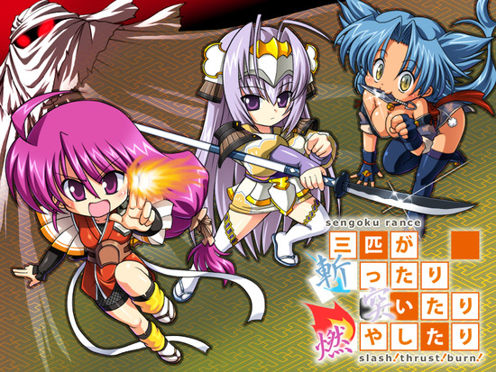

大家好，这里是卡拉保护协会带来的战兰外传《战国兰斯 - 三个乱斩乱刺乱烧的家伙》，也请一如既往地支持的说。

游戏原名：三匹が斬ったり突いたり燃やしたり。

直接解压补丁到游戏目录下运行。若游戏运行出错，则可能是游戏相关文件名乱码引起的，请运行“若游戏打开出错请运行我.bat”。

【声明】

别改补丁别移植

不要直播与录播

请勿商业与盈利

最终解释归协会

【Staff】

统筹：喻园咖吧

初翻：落羽碎風、光与影的狂舞

校对：LibCommander、Urbino

润色：LibCommander、会骑可乐猪

修图：萤火蟲

程序：Pkuism、空穜

测试：魔王盖伊、働いたら负け!、梵音正雨、好孩子加奈美

特别感谢：天殇、见解

【感言】

喻园咖吧（统筹）

忍忍～

落羽碎風（初翻）

三匹斩汉化撒花~

作为战兰外传估计很多人都没玩过，剧情还是很有意思的，各位好好享受吧

不多说了继续潜水爆肝~

光与影的狂舞（初翻）

就算是小品作铃女酱也在发光发热哦

LibCommander（校对、润色）

芜湖，加奈美好可爱

Urbino（校对）

很喜欢这个q版画风

会飞可乐猪（润色）

非常可爱的四只！我永远喜欢加奈美！

萤火蟲（修图）

我永远喜欢水无月萤。虽然很少玩RPG游戏，但我还是会继续支持此组

Pkuism（程序）

新人出道请多指教

魔王盖伊（测试）

铃女天下无敌

働いたら负け!（测试）

提前玩游戏 真好 赞

梵音正雨（测试）

从15年开始接触兰斯和a社，已经过了这么多年了，感谢兰斯的陪伴，也感谢汉化组们带来了这份伟大的作品

好孩子加奈美（测试）

我负责最后的测试环节，翻译风格还是r7那个味儿，程序也完全没有问题，不得不说汉化组真的辛苦了。剧情上这部小品几乎是铃女专场哦，玩到这里八代的遗憾总算得到些许安慰，铃女非常可爱是也！游戏系统有些简陋，不过通关依然存在困难，我第一次刷了好几轮，也算乐在其中吧。最后祝大家游戏愉快

链接：

[Onedrive](https://xxb401-my.sharepoint.com/:u:/g/personal/silas_acfun_nl/EUzqSdQE2L1Lno2N0iG1FiIByXcoBcFaR7d0wSuW1IOPEg?e=CuQqYm)

[网盘](https://pan.baidu.com/s/1rb-2-fqQjqX_FZONItxrEA) 提取码 k1w3

密码：卡拉保护协会

转载务必包含上述信息

