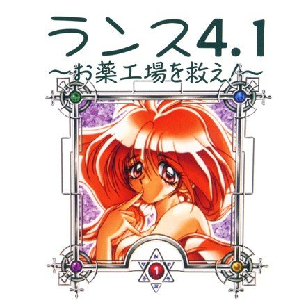

兰斯 4.1 ～拯救制药厂！～V1.0发布撒花 ♪，希望各位玩家游玩开心。

虽说兰斯4.1战斗比较容易，但本版也在原版的基础上新增了可选的队友手动战斗功能，可以通过战斗ＭＯＤＥ选择。

另外，本版激活了原版未使用的扳手腕剧情，修复了一些系统错误、战斗错误和道具错误。

通关完在爱丽丝之馆可见A社天狗传说的续篇小说，不过这和游戏无关，就不翻了。

本次发布也附带了试水的广播剧熟肉《兰斯～真实的兰斯～

０１：兰斯登场！》，可以在“广播剧BONUS”文件夹中欣赏。广播剧翻译暂此结束。

本次发布还附带了《兰斯4.1提示盘》，在“提示盘”文件夹里运行“运行提示盘.bat”可以查看攻略提示哦。但还是推荐自己先探索下游戏吧，这也是一种乐趣。里面有些设定是很早期的不用太在意啦，有一定考证价值。嗯，虽说原版提示盘还附赠了一部游戏，但是与本系列无关所以不放进去啦。

l【使用方法】

直接运行system3.exe打开游戏。

请使用Win7及以上系统运行本游戏。WinXP目前还无法读档。

选择音源可以切换CD、MIDI和FM音源，可以播放不同效果的BGM。（推荐）

游戏没有回看文本的操作，请谨慎使用右键快进以免错过剧情文本！

UI选项操作等待默认设置为100ms以保障操作流畅度，左键单击推进时如消息窗口输出结束将会自动将光标移动到菜单顶层选项上。请用一个放松的心态游玩游戏，仔细选择需要的选项。

中途退出游戏请记得存档以免丢失进度。

存档文件为游戏目录下ASLEEP_*.DAT。

新解压的游戏不存在MSGSKIP.DAT，打开后自动产生。

l【声明】

别改补丁别移植

不要直播与录播

请勿商业与盈利

最终解释归协会

l【兰斯4.1 Staff】

程序：喻园咖吧

初翻：落羽、LibCommander、光与影的狂舞

校润：♠﹏闹、LibCommander、bh20728、二牛子、Urbino、喻园咖吧

修图：萤火蟲、Kiss Nature

测试：雯晟俊杰、梵音正雨、好孩子加奈美、阴影中的原罪、冰封微笑

特别感谢：kichikuou、Rotten

Block、展鸿

l【兰斯4.1提示盘 Staff】

初翻：♠﹏闹

程序、校润：喻园咖吧

l【广播剧 Staff】

翻校：♠﹏闹、LibCommander、喻园咖吧

打轴：萤火蟲

l【感言】

喻园咖吧：

翻完一部就少一部呢，且行且珍惜的说。

游戏体量不算大，但由于RPG文本分散性，花了很多时间打磨，还是等了挺久的说。

PS：本作能支持64位系统，真的很感谢开源社区的帮助ღ

落羽：

4.1汉化完成撒花~，粉色假面登场，各位好好享受游戏吧~

光与影的狂舞：

粉红女超人登场——

♠﹏闹：

作为小品还是蛮有意思的，战斗系统比较鸡肋。希露作为隐藏角色屡屡登场是个亮点。

bh20728：

就算是很多年前的游戏，但r4.1的行文读起来相当舒服，也很有趣味，希望大家能亲自玩一玩

二牛子：

谢谢各位的捧场，感谢汉化组能给这样一个机会让本人参与校对的工作，如果大家在游戏游玩过程中觉得本汉化工作做得不错，就是对我们汉化工作最大的慰劳，希望Ｒ４．１也能够在各位玩家的心中留下欢乐的回忆

萤火蟲：

修图期间也会有遇到过困难，无从下手，虽说最后解决了，但会比别人付出多一倍的时间。感谢汉化组给我机会练习以及教导。ps:我永远喜欢水无月萤

Kiss Nature：

喻大真可爱～（有什么不对）

雯晟俊杰：

4.1内容并不多，测试的时候玩了4、5遍，不看攻略一两个小时就能玩完，虽然说4.1也有雷，但是跟5D比起来简直是小巫见大巫。最近越来越忙了，尽量多抽时间把以前没怎么玩过的古老版本全都补齐，R4和R4.1都完事了，现在就差一个R4.2了，至于鬼兰嘛，等我写完R10再说吧，笑

梵音正雨：

兰斯系列的本篇很快就要完成全汉化了，感谢各个汉化组持续了这么多年的传递

好孩子加奈美：

正宫希露天下第一

Rotten Block：

Hello to all Chinese-speaking Rance fans!

Rance 4.1 and 4.2 are very memorable games, with classic adventure game puzzles

but also a unique combat system. These games have been trapped behind technical

issues for years but we're slowly solving those and I'm glad to know they'll be

reaching a new audience soon!

kichikuou：

Have fun!

l【开源引擎】

github.com/kichikuou/system3-sdl2

【卡拉保护协会】兰斯 4.1～拯救制药厂！～V1.01

链接: [网盘](https://pan.baidu.com/s/1RguCvX1xmwM-haH970hsxw) 提取码: qkck

[Onedrive](https://xxb401-my.sharepoint.com/:u:/g/personal/silas_acfun_nl/EY3Fgrpw9wxBu26i6InzFyEBF4EzVriZwcP4pTntrxJgbA?e=OIbvlq)

百度秒传： 86014d2bda5658b0e4644a21f2cd6bfa#4ca76d5a746e34eb7ad7487a546178b5#163355347#【卡拉保护协会】兰斯 4.1～拯救制药厂！～V1.01.rar

解压密码：卡拉保护协会
