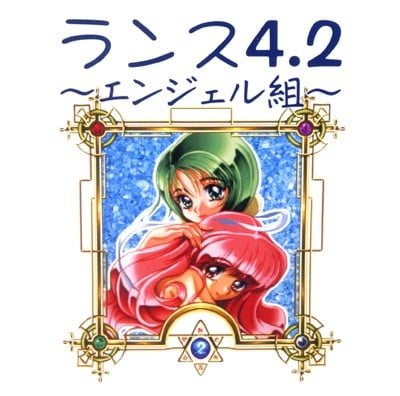

 

**兰斯4.2发布撒花♪** 兰斯系列正史汉化到此算是圆满，在此说一句——

 

**Thank you for playing THE RANCE SERIES**

 

l【内容】

 

本版完成了跟游戏相关的全部文本翻译，在原版的基础上新增了可选的队友手动战斗功能，可以通过战斗ＭＯＤＥ开启。另外，本版激活了原版未使用的沙坑跳远比赛内置游戏，修复了一些系统错误、战斗错误。

 

本次发布也附带了广播剧熟肉《兰斯～真实的兰斯～ 02.魔将军巴布兹》，可以在“广播剧BONUS”文件夹中欣赏。广播剧翻译暂此结束。

 

本次发布还附带了《兰斯4.1/4.2提示盘》，在“提示盘”文件夹里运行“运行提示盘.bat”可以查看攻略提示哦。里面涉及一定剧透，请自己先探索下游戏吧。里面有些设定是很早期的不用太在意啦，有一定考证价值。嗯，虽说原版提示盘还附赠了一部游戏，但是与本系列无关所以不放进去啦。

 

l【兰斯4.2 Staff】

 

程序：喻园咖吧

初翻：落羽、LibCommander、光与影的狂舞

校润：闹、LibCommander、bh20728、荆棘、二牛子、路漫漫、喻园咖吧

修图：萤火蟲、Kiss Nature

测试：雯晟俊杰、魔王盖伊、好孩子加奈美、冰封微笑

特别感谢：kichikuou、Rotten

Block

 

l【兰斯4.1/4.2提示盘 Staff】

初翻：闹

程序、校润：喻园咖吧

 

l【广播剧 Staff】

翻校：闹、LibCommander 等

打轴：萤火蟲

 

l【使用方法】

 

直接运行system3.exe打开游戏。

请使用Win7及以上系统运行本游戏。WinXP目前还无法读档。

选择音源可以切换CD、MIDI和FM音源，可以播放不同效果的BGM。（推荐）

游戏没有回看文本的操作，请谨慎使用右键快进以免错过剧情文本！

UI选项操作等待默认设置为100ms以保障操作流畅度，左键单击推进时如消息窗口输出结束将会自动将光标移动到菜单顶层选项上。请用一个放松的心态游玩游戏，仔细选择需要的选项。

中途退出游戏请记得存档以免丢失进度。

存档文件为游戏目录下ASLEEP_*.DAT。

新解压的游戏不存在MSGSKIP.DAT，打开后自动产生。

 

 

l【感言】

 

喻园咖吧：

很高兴能够为持续３０年的经典贡献自己的力量，能初步凑齐了兰斯１０片尾作品，真的是很感谢各位组员大佬的辛苦付出，在此也向前人致敬。其实我自己还是今年才开始接触兰斯的，即使本人不是技术流，但总之就是很喜欢这个绿衣男的冒险史诗。本作命之圣女的出场更是让人印象深刻，光是为了温丽娜就应该打一打本作?～

 

落羽：

R4.2完成，至此兰斯全系列汉化全部完成~！喻大流啤！

本作算是小故事级别，不过出场角色很有趣，还能第一次见到兰斯大爷正被弄死的正史233，总之，各位享受游戏吧~

 

闹：

言里牛逼就完事了

 

LibCommander：

终于，兰斯系列的汉化算是补完了，很荣幸参与到这趟末班车上，就像我4里的感言说的，很遗憾这几作没有重置作品，而且眼下也盼不到A社重制。希望这几作的补完，能弥补目标全系列粉丝（俺也一样）的遗憾。另外，大家有注意到4.1没有我的感言吗，隔太近了真的没啥好说的所以我就没写，而且你们可以瞅瞅4.2爱丽丝馆里的职员也有不少人说了类似的话，所以我...（）旧作的爱丽丝馆里边也有不少有意思的内容，大家可以去看看喔。

 

bh20728：

这次兰斯4.2的汉化也是兰斯系列最后一部未汉化正史的汉化，作为和4.1一样的小数点作，其篇幅和游戏性都有所限制，但我相信玩家在游玩这部游戏时，同样能体会到快乐，这正是兰斯系列的魅力所在。

 

荆棘：

兰斯系列补完计划大成功！下次安利别人的时候不用跳过4.X了

 

二牛子：

终于看到了命女，兰１０扛把子

 

萤火蟲：

首先还是恭喜本组将兰斯系列做完了，从中我也学到了不少事，感谢组给我的机会，虽然还是存在不足，但我会继续努力。ps:我永远喜欢水无月萤

 

Kiss Nature：

喻大YYDS！（依然有些不♂对）

 

雯晟俊杰：

以前玩4、4.1和4.2都是生啃的，完全没看懂剧情，现在终于汉化完了，剧情也在测试的时候了解清楚了，感谢汉化组给我这个测试的机会，能够参与4、4.1和4.2的汉化测试表示很荣幸。同时，本作也是兰斯系列汉化的最后一作，完结撒花。至于攻略我已经在测试的时候一边玩一边写完了，应该在近期就能发布，玩之前还是要先看须知避免踩雷。我的下一个攻略应该就是R8了，虽然已经到收尾阶段了，但是由于工作繁忙一直没有时间玩，好揪心。

 

魔王盖伊：

粉红假面卡哇伊

 

好孩子加奈美：

从18年初识此系列到现在最后一部正史汉化完毕，三年间我通关了全十二部的主线剧情。除开第十部来自DL，剩下作品能够让大家体验全靠汉化组的用爱发电，非常有幸能够参与这次收官汉化测试！

 

冰封微笑：

大大小小的冒险，各种各样的伙伴，一路精彩与欢笑，感谢人生遇到你，兰斯！

 

Rotten Block：

Hello to all Chinese-speaking Rance fans!

Rance 4.1 and 4.2 are very memorable games, with classic adventure game puzzles

but also a unique combat system. These games have been trapped behind technical

issues for years but we're slowly solving those and I'm glad to know they'll be

reaching a new audience soon!

 

kichikuou：

Have fun!

 

 

l【开源引擎】

github.com/kichikuou/system3-sdl2

 

l【声明】

 

别改补丁别移植

不要直播与录播

请勿商业与盈利

最终解释归协会

 

【卡拉保护协会】兰斯 4.2～天使组～V1.0 

[Onedrive](https://xxb401-my.sharepoint.com/:u:/g/personal/silas_acfun_nl/EScDRwiQ14tEjpa88Tqm0yIB_F8HyesVvncIvonV0VV5dQ?e=jw3NmB)

链接: [网盘](https://pan.baidu.com/s/1zkbJ_PsizWCn6Sn17Fa22Q) 提取码: cpbh

百度秒传： f917e751a98df750ba4442f0689cdff7#d55ea9f084f5c930a50be16ecf608939#190440509#【卡拉保护协会】兰斯 4.2～天使组～V1.0.rar

 

解压密码：卡拉保护协会